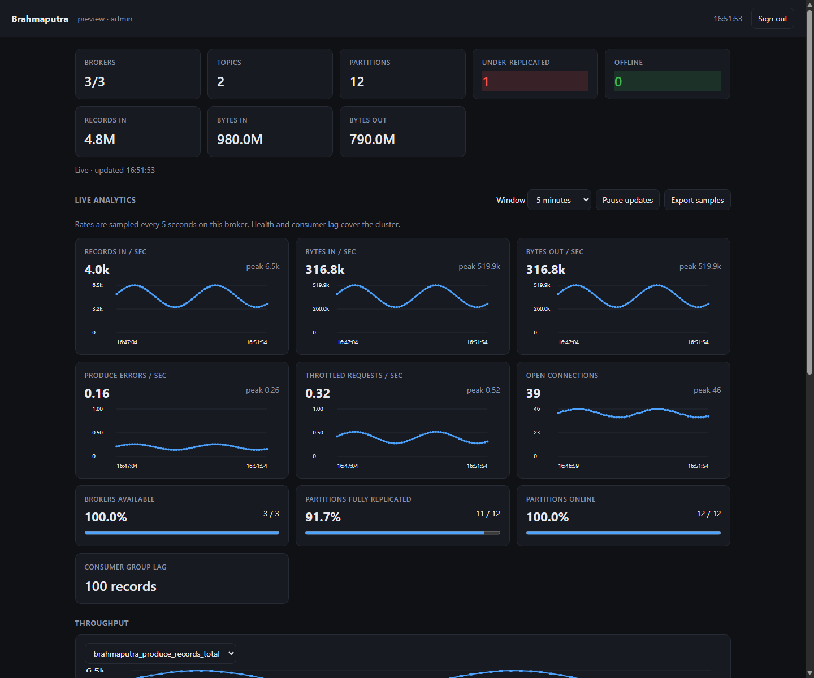
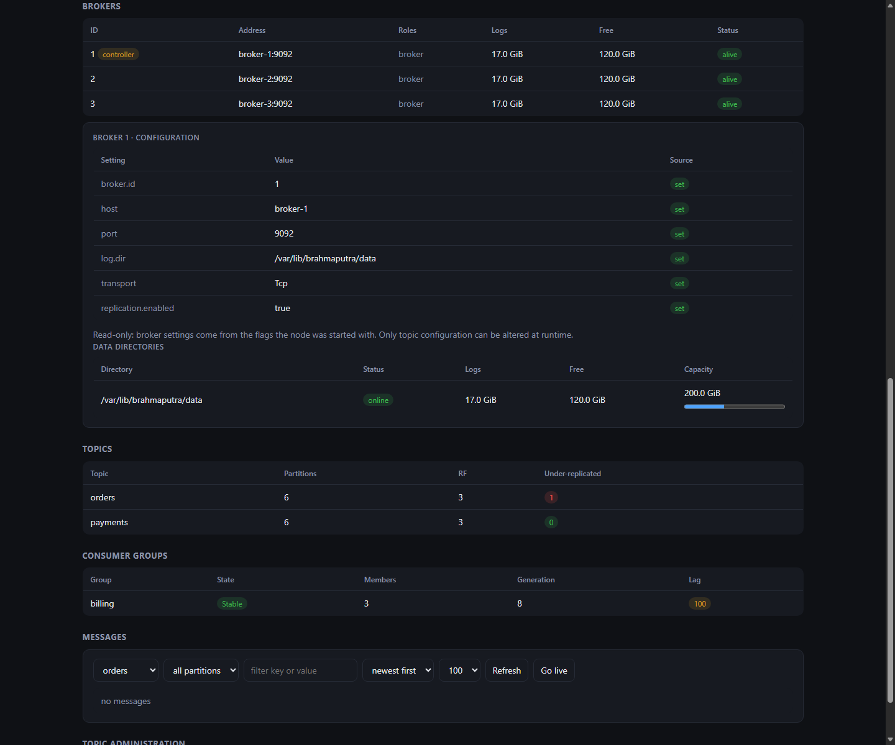
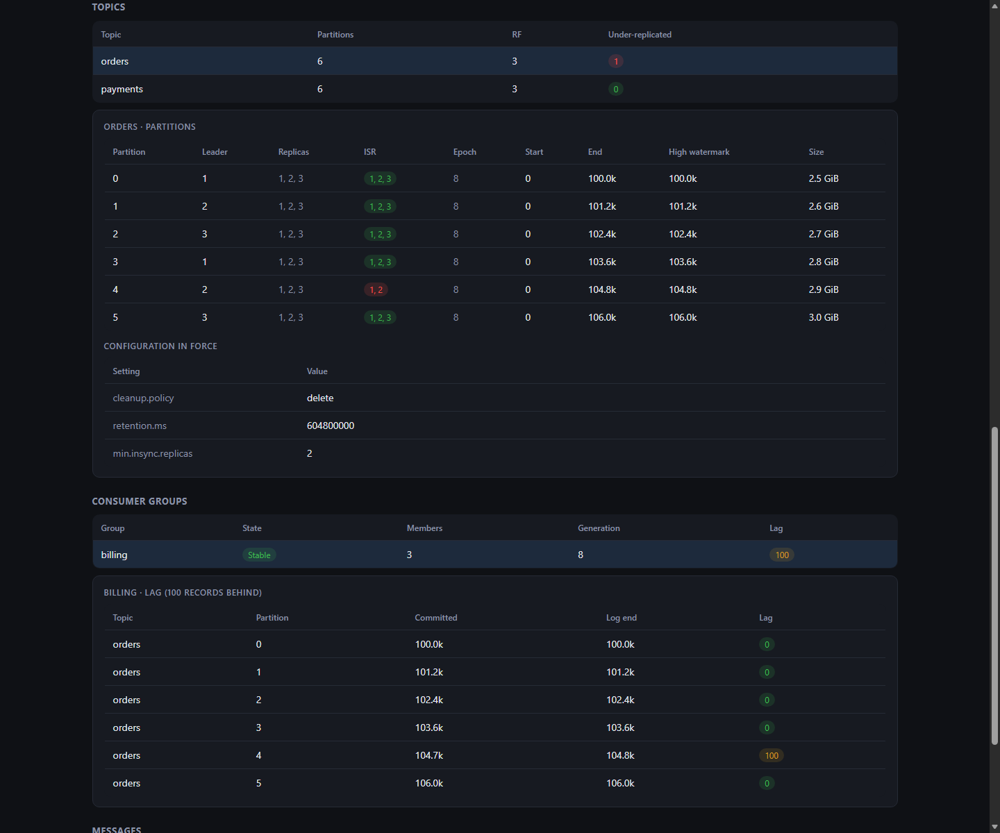

<div align="center">

# 🌊 Brahmaputra

**A distributed log streaming platform in Rust.**
Kafka's model — partitioned, replicated, append-only logs — in one static
binary, with no JVM, no ZooKeeper and no heap to tune.

[](https://github.com/byte-mods/brahmaputra/actions/workflows/ci.yml)
[](LICENSE)
[](https://www.rust-lang.org)
[](#verification)
[](#performance)
[](#transports)
[](#authentication-and-access-control)
[](docs/kafka-parity.md)
[](#client-libraries-in-24-languages)
[](#websocket-gateway)

</div>

```bash
brahmaputra-server --data-dir ./data                    # a broker
brahmaputra-cli produce --topic orders --value hello    # write
brahmaputra-cli consume --topic orders --from earliest  # read
open http://localhost:8080                              # dashboard
```

|  | |
|---|---|
| 🚀 **Measured against Kafka** | Reproducible comparisons cover replication, concurrency, record size, codecs and delivery settings. Results depend on workload and host. [Measurements and method →](#performance) |
| 🧩 **One static binary** | Broker, controller, dashboard and metrics compiled in. No JVM, no ZooKeeper, no Prometheus required. |
| 🔁 **Kafka semantics, not just Kafka shape** | Leader/ISR replication, leader-epoch truncation (KIP-101), high-watermark visibility, `acks=0/1/all`, idempotent **and transactional** producer, `read_committed` isolation, consumer groups with generation fencing. |
| 🌐 **Clients in 24 languages** | Rust, Go, Node.js/TypeScript, Python, Java, Kotlin, Scala, C#, F#, C, C++, D, PHP, Ruby, Perl, Lua, Erlang, Elixir, Haskell, OCaml, Crystal, Nim, Dart. Each has the full producer, consumer and group feature set and is verified against a live broker. [Clients →](#client-libraries-in-24-languages) |
| 📱 **WebSocket gateway and UI SDKs** | Phones and browsers publish into keyed topics and subscribe to live ones (a stock price feed, with a snapshot of every symbol's latest price) through a stateless gateway that scales out without touching the brokers. It costs about 5 KB per socket, and each instance reads a topic once however many screens watch it. SDKs cover React, Vue, Angular, Svelte, Flutter and plain JS/TS. [Gateway →](#websocket-gateway) |
| 🔌 **Three transports, one flag** | Plain TCP, TLS 1.3, or QUIC — same wire format, same correctness suite. |
| 🧪 **Verified by killing things** | Live scripts start real brokers, `kill -9` them mid-write, and audit what survived. Not only unit tests. |
| 📊 **Operations built in** | Browse and live-tail messages, add partitions, change topic config, consumer lag, Prometheus endpoint, login and RBAC — [in one container](#docker). |
| 🔐 **Authentication and ACLs** | Principals bound per connection — by SCRAM-SHA-256, which never sends the password, or by a client certificate your CA signed — with deny-by-default authorization on topics, groups and the cluster. [Details →](#authentication-and-access-control) |
| 🔒 **Exactly-once** | Transactions across partitions, `read_committed` isolation, and offsets committed with the output they came from. [Details →](#transactions) |
| 💽 **One disk failure is not one broker failure** | Give the broker its disks directly; a failed one takes only its own partitions offline. [Details →](#one-broker-several-disks) |

---

## Contents

- [Status](#status)
- [Why it exists](#why-it-exists)
- [Quick start](#quick-start)
- [Running a cluster](#running-a-cluster)
- [Transports](#transports)
- [Producing and consuming](#producing-and-consuming)
- [Consumer groups](#consumer-groups)
- [Using the Rust client](#using-the-rust-client)
- [Client libraries in 24 languages](#client-libraries-in-24-languages)
- [WebSocket gateway](#websocket-gateway)
- [Transactions](#transactions)
- [One broker, several disks](#one-broker-several-disks)
- [Inspecting and trimming a cluster](#inspecting-and-trimming-a-cluster)
- [Authentication and access control](#authentication-and-access-control)
- [Dashboard, metrics and access control](#dashboard-metrics-and-access-control)
- [Docker](#docker)
- [Durability, retention and quotas](#durability-retention-and-quotas)
- [What happens when things fail](#what-happens-when-things-fail)
- [Configuration reference](#configuration-reference)
- [Verification](#verification)
- [Performance](#performance)
- [Architecture](#architecture)
- [Repository layout](#repository-layout)
- [Building](#building)
- [Kafka parity and non-goals](#kafka-parity-and-non-goals)
- [License](#license)

---

## Status

| Milestone | Scope | Status |
|---|---|---|
| M1 | Single node: storage engine, wire protocol, producer/consumer client, CLI | ✅ complete |
| M2 | Raft controller quorum, metadata, multi-broker | ✅ complete |
| M3 | Replication: ISR, high watermark, leader-epoch failover | ✅ complete |
| M4 | Consumer groups and offset management | ✅ complete |
| M5 | Hardening: retention, fsync policies, quotas, TLS, fault injection, benchmarks | ✅ complete |
| M6 | Metrics API, embedded dashboard, login and RBAC | ✅ complete |
| M7 | Multi-partition Produce/Fetch, concurrent request handling, benchmark vs Kafka | ✅ complete |
| M8 | Data-plane authentication and ACLs, log compaction, message explorer, Docker image | ✅ complete |
| M9 | Preferred-leader rebalancing, admin APIs, quota entities, mutual TLS | ✅ complete |
| M10 | Transactions and `read_committed` isolation | ✅ complete |
| M11 | JBOD: several disks per broker, failure isolated per disk | ✅ complete |
| M12 | Tombstones and real compaction, transaction expiry, follower fetching, fetch sessions, SCRAM | ✅ complete |
| M13 | Cluster-wide dashboard views, local hosting scripts, sole-replica recovery | ✅ complete |
| M14 | Surviving a controller outage, topic incarnations, hostile-input decoding | ✅ complete |
| M15 | Review release: transactions and groups under leader change, fetch-path race, hot-path costs | ✅ complete |
| M16 | Client libraries in 24 languages with a shared feature contract, WebSocket gateway, BitPacker for 24 languages | ✅ complete |
| M17 | Gateway subscriptions (fan-out with snapshots), UI SDKs for React, Vue, Angular, Svelte, Dart and Flutter, tested in real browsers | ✅ complete |

Every milestone is verified by live scripts that start real brokers, kill
them, and audit what survived — not only by unit tests. See
[Verification](#verification).

### Upgrading to 0.10.0

A drop-in upgrade: publish-only clients and deployments behave exactly as
before. Subscriptions stay off until you pass `--allow-subscribe`. Then
issue tokens with a `subscribe` claim (or none, to allow whatever the
gateway allows), and use the [UI SDKs](clients/ws) or send
`{"op":"subscribe",...}` yourself. Each gateway instance opens one extra
broker connection per subscribed topic. See the
[changelog](CHANGELOG.md#0100--2026-09-27).

### Upgrading to 0.9.2

A drop-in patch; only the C client changes. Rebuild applications that
use the C client's consumer groups. In 0.9.1 and earlier, a member whose
heartbeats were starved by a tight polling loop could be evicted
mid-rebalance and keep fetching its old partitions. Group traffic now has
its own connection. See the [changelog](CHANGELOG.md#092--2026-09-27).

### Upgrading to 0.9.1

A drop-in patch for 0.9.0; no data, wire or configuration changes.
Upgrade the CLI and any application using the Rust `GroupConsumer`. In
0.9.0 a poll that had to join its group could spend its whole wait on the
join and return empty, so `brahmaputra-cli consume --group` sometimes
exited without reading. The minimum supported Rust is now 1.88. See the
[changelog](CHANGELOG.md#091--2026-09-27).

### Upgrading to 0.9.0

The broker, its wire format (BitPacker wire version 4) and the disk format
are unchanged, so brokers need no coordinated upgrade. 0.9.0 adds clients
and services around it:

- **Client libraries in 24 languages.** Each one is audited against one
  producer/consumer/group feature contract and verified by an
  80–88-check live suite ([matrix](docs/client-feature-matrix.md)).
- **The WebSocket gateway**, a separate binary (`brahmaputra-ws-gateway`)
  that you deploy beside the cluster.
- **Rust client additions:** `Producer::send_with_timestamp`,
  `Producer::partition_for`, `Producer::close`, and settable request
  timeouts. The timeout defaults to unbounded, so existing callers are
  unaffected.
- **Behaviour changes in some existing drivers:**
  - Ruby, Perl and Lua producers no longer resend a batch after a
    connection drops mid-request, which could write it twice. They retry
    only retriable broker errors, as the other drivers do.
  - Python's default compression is now `none` (it was `lz4`, which
    needs an optional package).

### Upgrading to 0.8.1

BitPacker message encoding remains wire version 4; record framing and the disk
format are unchanged. This release reduces cold routing and connection setup
costs, removes record-encoding copies, and makes conditional lease recovery
safe when a registration response is lost or metadata arrives first.
Controller disk writes preserve immediate durability while running outside
Tokio's async workers. See the [changelog](CHANGELOG.md) for details.

Upgrade every controller to retain registration receipts throughout recovery;
mixed-version controller recovery has not been validated. The new
`--group-initial-rebalance-delay-ms` flag defaults to the existing 1,000-ms wait.

### Upgrading to 0.8.0

The wire protocol remains version 4 and the disk format is unchanged.
Restart brokers and upgrade clients to get the fixes described in the
[changelog](CHANGELOG.md). This release closes an authorization gap in
incremental fetch sessions and makes transactional consumption available
through consumer groups:

```bash
brahmaputra-cli consume --topic orders --group billing \
  --isolation-level read_committed --follow
```

In Rust, use
`GroupConsumer::with_isolation_level(IsolationLevel::ReadCommitted)`.
The default remains `ReadUncommitted`. Aborted records stay hidden in
committed mode, even when they exceed the fetch byte budget; open
transactions hold consumption until their decision is known.

Run the complete shell verification set with `bash scripts/verify-release.sh`
after building both debug and release binaries. Logs and a CSV of results
are retained under `bench/results/release-verification/`.
The [validation matrix](docs/release-validation-matrix.md) maps failure,
consumer-group, configuration, security and benchmark scenarios to their suites.

Lease recovery also handles delayed expiry commands, out-of-order heartbeats,
stale controller validation, and seed-broker re-registration. Cluster routing
metadata remains readable during a local lease suspension; writes and fetches
remain fenced until the lease is valid.

Kafka wire compatibility remains the largest missing capability: native
Kafka clients and ecosystem tools cannot connect to this custom protocol.

Controller defaults now use a 200-ms Raft heartbeat, 1–2-second elections,
and at most 32 metadata entries per replication batch to improve catch-up
after outages. These are distinct from broker heartbeat and lease settings.

### Upgrading to 0.7.0

**No wire change and no on-disk format change**: the protocol stays at
version 4 and a 0.6.0 client talks to a 0.7.0 broker. The high-watermark
checkpoint file is folded back to its 8-byte prefix once it passes 64 KiB;
either version reads the other's file. Upgrading is a restart.

This is a review release: the code was read against the guarantees it
claims, and what follows is what that found. Full detail is in the
[changelog](CHANGELOG.md).

**Transactions and consumer groups now survive a leader change.** Four
separate holes closed: a transaction marker carried leader epoch 0 and was
rejected by every follower after the partition's first failover, which
knocked the follower out of the ISR for good; the group and transaction
coordinators cached their state for the life of the process, so a broker
that lost and regained a `__consumer_offsets` partition served offsets from
before and rewound consumers; a transactional offset commit never reached
live coordinator state and replay read it uncommitted, so an aborted commit
could become a group's position; and compaction let a record from an
aborted transaction supersede the committed value under the same key.
Alongside them, a 0.6.0 regression: a deleted-and-recreated
`__consumer_offsets` was never drained, so every group request on a broker
that had opened it failed forever.

**The fetch fallback no longer races on a shared file position.** On
Windows, macOS and every buffered path, two concurrent readers of one
segment could each get the other's bytes. Segment reads are positional now.

**Client contracts.** A batched producer retries a moved leader instead of
failing the caller until restart, and auto-commit no longer acknowledges
the batch the application is still processing — it commits what stood at
the previous `poll`, which is when that batch is known to be done.

**Costs that scaled with the wrong thing.** A partition lookup no longer
takes the broker-wide lifecycle mutex that was held across `Log::open`; a
64 KiB fetch no longer reads and zero-fills a megabyte; `FetchMulti` waits
on watermarks instead of re-reading every partition every 5 ms; and the
high-watermark checkpoint stops growing forever.

### Upgrading to 0.6.0

**No wire change and no on-disk format change**: the protocol stays at
version 4, and a 0.5.0 client talks to a 0.6.0 broker. Each partition
directory gains one 8-byte `.topic-epoch` marker the first time the broker
opens it; a directory that has none is adopted in place, so existing logs,
indexes and checkpoints are read unchanged. Upgrading is a restart.

That restart is worth doing for three reasons.

**A controller outage no longer kills the brokers that survived it.** A
broker that could not renew its lease used to treat that as proof it had
been superseded, and exited. It is not proof: a broker that cannot reach a
controller at all learns nothing about whether another incarnation of
itself exists. Losing the Raft leader for longer than
`--session-timeout-ms` therefore took down the *whole* cluster — the two
nodes that were still healthy self-terminated. Five things changed, because
the same assumption sat at five layers:

- An expired lease **suspends** the data plane instead of ending the
  process: the broker stops serving, keeps its listeners and actors, and
  re-registers with `expected_epoch` set to the epoch it held. The
  controller accepts that only if no newer incarnation has taken over, so a
  current process resumes and a zombie is refused. `fence()` remains
  irreversible for the case that *is* proof — an epoch change seen while
  the lease is live.
- A **controller fence of the epoch this broker holds** is treated the same
  way: the controller fences whatever it has not heard from, and silence
  during an election is not evidence of a replacement.
- A **new controller leader fences nobody for one session timeout.**
  Renewing a lease is a quorum write, so an election is a window in which
  no broker can renew and every timestamp the new leader inherits is
  already stale. This is the grace Kafka's controller gives after a
  failover.
- `RegisterBroker` and `Heartbeat` are **stamped when they are proposed**,
  not when they are built. A registration that waited seconds for a quorum
  used to commit already looking overdue, and the next maintenance pass
  fenced the broker that had just come back.
- A partition whose **whole ISR was fenced** is recovered by any replica
  that was in that ISR (`last_isr`), not only by a sole replica as in
  0.5.0. In-sync means it holds every committed record, so this is a clean
  election. A replica that had already fallen out is still not eligible —
  that is unclean election, and it stays an explicit decision.

**A deleted topic's data can no longer come back under its name.** Topic
names are reusable, and a partition directory had no durable link to the
topic incarnation that created it, so recreating `orders` reopened the
deleted `orders-0` log and served records the operator had deleted.
`CreateTopic` now stamps a monotonic `topic_epoch` into the metadata,
brokers persist it in `.topic-epoch` beside each replica, and a mismatch
discards the stale directory before the log can be opened. Deleting a
partition now also shuts its actor down cleanly and retries a removal that
failed, rather than dropping the handle and leaking the directory.

**Malformed frames are rejected instead of read out of bounds.** The
generated BitPacker decoder read varints, booleans and lengths through
`get_unchecked` on the theory that the data source was trusted. The data
source is the network. Every read is now bounds-checked and raises a
decode-error flag that each generated `decode` checks before returning;
overlong varints, negative and impossible lengths, and invalid UTF-8 are
refused as errors rather than followed. The generator in `tools/bit-packer`
emits the checked form, so regenerating the protocol reproduces the
checked-in files byte for byte. Quota accounting
was the same shape of problem one layer up: it keyed live buckets by the
peer-supplied `client.id`, so rotating that string grew broker memory
without bound. Buckets are now keyed by a seeded hash and capped at 4,096.

One client-side change comes with them: a producer **retries
`UNKNOWN_TOPIC_OR_PARTITION`**, refreshing its route first. Topic creation
reaches brokers asynchronously, so a send issued immediately after
`topic create` used to fail outright; a topic that really does not exist
still fails, once the retry budget is spent.

### Upgrading to 0.5.0

**No wire change and no on-disk change**: the protocol stays at version 4,
logs and checkpoints are read unchanged, and a 0.4.0 client talks to a
0.5.0 broker. Upgrading is a restart.

That restart is worth doing, because 0.5.0 fixes a partition that could
never come back. Fencing a broker empties the ISR and clears the leader.
With several replicas another one takes over and the returning broker
rejoins through it; with **one** replica there was no leader to rejoin
through, and the two rules that keep ISR membership safe deadlocked —
`ChangePartition` will not make a broker leader unless it is already in the
ISR, and only a leader can widen the ISR. The partition stayed offline
permanently even though its only replica was back holding the whole log.

`__consumer_offsets` is created with one replica per partition, so this
took out consumer groups: a group is coordinated by
`crc32c(group) % partitions`, and any group whose coordinator partition sat
on a broker that had once restarted could never start again. It failed as
`unknown topic-partition "__consumer_offsets"-N`.

Registration now restores leadership for partitions where the returning
broker is the **only** replica. That is a clean election, not an unclean
one: with one replica that log *is* the partition, so there is no more
recent data anywhere to lose. Partitions with several replicas and an empty
ISR are deliberately left alone — there, choosing which returning replica
to believe can genuinely discard writes, and that belongs to an explicit
unclean-election policy rather than to whichever broker registers first.

Affected clusters heal on the next broker restart; nothing has to be
recreated and no data is touched.

### Upgrading to 0.4.0

**The wire version moved from 3 to 4, so brokers and clients must be
upgraded together.** A version-3 client gets a clean `UNSUPPORTED_VERSION`
rather than misparsing, which makes the mismatch obvious instead of
mysterious — but it does mean a rolling upgrade needs both halves. All four
native drivers in [clients/](clients) ship updated.

Version 4 added **tombstones**: a record's value may be null, which is what
deletes a key on a compacted topic. A version-3 client would read a
tombstone's length prefix as a value length and misparse every record after
it, which is exactly the case the exact-match rule exists to prevent.
Alongside it: `client.rack` and incremental fetch sessions on
`Fetch`/`FetchMulti`, a rack per broker in `Metadata`, a SASL mechanism on
`Authenticate`, and five new APIs (`AlterConfigs`, `DescribeProducers`,
`ListTransactions`, `DescribeTransactions`, `AlterReplicaLogDirs`).

Nothing on disk changed shape: existing logs, indexes, checkpoints and
transaction journals are read unchanged. A batch without a tombstone
encodes to exactly the bytes it did before, which is why the record format
gained an attributes bit rather than a magic bump.

One behaviour changes for existing users. `__consumer_offsets` expiry now
writes real tombstones, so a compacted offsets topic will actually shrink
where before it only ever grew.

## Why it exists

Kafka's model — partitioned, replicated, append-only logs that consumers
read at their own pace — is the right one. What it costs is a JVM per
broker, a heap to tune, and an operational surface that assumes a team.
Brahmaputra keeps the model and removes those costs:

- **One static binary.** No JVM, no ZooKeeper, no separate controller
  process, no external metrics stack. The dashboard is compiled in.
- **No JVM heap to configure.** The broker passes refcounted byte slices
  and uses the page cache. Actual memory use depends on the workload;
  the [benchmarks](#performance) report measured broker and client costs.
- **Choice of transport.** Plain TCP, TLS 1.3 over TCP, or QUIC — same
  wire format, one flag.

## Quick start

```bash
cargo build --release

# A single broker with four partitions per auto-created topic.
./target/release/brahmaputra-server --data-dir ./data --default-partitions 4

# In another shell:
./target/release/brahmaputra-cli produce --topic orders --key user-7 --value '{"id":1}'
./target/release/brahmaputra-cli consume --topic orders --from earliest --max 10
./target/release/brahmaputra-cli offsets --topic orders
```

The dashboard is on <http://localhost:8080>. A single broker has no
controller, so it serves metrics and read views but not user management —
for that, run a cluster.

## Running a cluster

A node runs as broker, controller, or both. Three or five combined nodes is
the usual shape: the controllers form a Raft quorum that owns all metadata,
and the brokers serve data.

```bash
# Repeat per node, changing --node-id and the ports.
brahmaputra-server \
  --node-id 1 --cluster-id prod \
  --host 10.0.0.1 --port 9092 --control-port 19092 --http-port 8080 \
  --controller-peer 1=10.0.0.1:19092 \
  --controller-peer 2=10.0.0.2:19092 \
  --controller-peer 3=10.0.0.3:19092 \
  --data-dir /var/lib/brahmaputra

# Once, on any node: form the quorum.
curl -X POST http://10.0.0.1:19092/api/v1/controller/bootstrap
```

Then create a topic through the controller:

```bash
brahmaputra-cli --controller http://10.0.0.1:19092 \
  topic create --name orders --partitions 6 --replication-factor 3 \
  --config min.insync.replicas=2
```

Clients connect to **any** broker and are routed to partition leaders
automatically; there is no bootstrap-server list to maintain beyond one
reachable address.

### A three-node cluster on one machine

For development, [scripts/run-cluster.sh](scripts/run-cluster.sh) runs the
same shape locally — three combined broker/controller nodes separated by
port rather than by address, dashboard included:

```bash
scripts/run-cluster.sh start     # build if needed, start, form the quorum
scripts/run-cluster.sh status    # brokers, controller view, topics
scripts/run-cluster.sh logs 2    # tail node 2
scripts/run-cluster.sh stop      # stop all three, keep the data
scripts/run-cluster.sh destroy   # stop and delete the data directories
```

Ports are `base + node - 1`: data 9092–9094, controller 19092–19094,
dashboard 8080–8082. Shift a base when something else holds it — a Kafka
container on 9092 is the usual collision:

```bash
DATA_PORT_BASE=9192 HTTP_PORT_BASE=8090 scripts/run-cluster.sh start
```

The resolved ports land in `data/cluster/cluster.env`, which the other
scripts read, so a shifted cluster stays usable without repeating the
variables. State lives under `data/cluster`, and `stop` leaves it in place
so a restart rejoins the same cluster with the same logs.

Two scripts drive it:

```bash
scripts/load-100k.sh        # push 100,000 records at acks=1, then verify them
scripts/consume-follow.sh   # tail the topic, printing each record
```

`load-100k.sh` does not trust the producer's own count: it sums partition
offsets before and after and fails unless the total moved by exactly the
number requested, then checks the ISR — `acks=1` is precisely the setting
where "the client thinks it sent it" and "the replicas hold it" can differ.
`COUNT`, `VALUE_SIZE`, `TOPIC`, `PARTITIONS` and `RATE` are all
overridable; offering below saturation with `RATE` is what makes the
latency percentiles mean what a caller waits for.

`consume-follow.sh` tails from `latest` by default, so it prints records as
they arrive rather than opening with the whole backlog. `FROM=earliest`
replays, `GROUP=""` reads standalone without committing.

## Transports

Same frames, three carriers. Broker and client must agree.

| `--transport` | Multiplexing | Encryption | Head-of-line blocking |
|---|---|---|---|
| `tcp` (default) | one byte stream, correlation ids | none | yes |
| `tcp-tls` | one byte stream, correlation ids | TLS 1.3 | yes |
| `quic` | one bidirectional stream per request | TLS 1.3 | no |

```bash
brahmaputra-server --transport quic ...
brahmaputra-cli --transport quic --broker host:9092 metadata
```

All three carry producers, consumers, group coordination *and*
inter-broker replication, and all three pass the same correctness suite
(`scripts/verify-transport-parity.sh`). TCP is the default because it is
substantially faster on a LAN — QUIC's advantages appear on lossy or
long-haul links, and its costs are measured in
[docs/benchmarks.md §5](docs/benchmarks.md).

QUIC probes for larger UDP payloads up to 9,000 bytes on capable paths. It
starts with small packets and increases their size only after successful
probes, so ordinary-MTU paths do not require jumbo-frame configuration.

TLS uses a self-signed certificate generated at startup. That gives
confidentiality and integrity; identity comes from
[authentication](#authentication-and-access-control), which must be
enabled separately.

## Authentication and access control

Off by default, matching a Kafka `PLAINTEXT` listener. Production should
turn it on:

```bash
brahmaputra-server --require-auth --transport tcp-tls ...
```

With `--require-auth`, a connection starts anonymous and is refused until
it authenticates, and an authenticated principal still needs a matching
ACL. **The default is denial** — enabling authentication cannot silently
widen access.

```rust
let connection = Connection::connect_with(Transport::TcpTls, addr, id, 5).await?;
connection
    .authenticate(&Credentials::new("billing", "…"))
    .await?;
```

or from the command line, on any listener:

```bash
brahmaputra-cli --sasl-username billing --sasl-password … consume --topic orders
```

The default mechanism is **SCRAM-SHA-256**, in which the password never
crosses the wire: the broker sends a challenge and the client answers with
a proof derived from the password. That is what makes authentication
meaningful on a listener that is not encrypted, and it is why SCRAM is the
default rather than an option.

`--sasl-mechanism plain` sends the password itself, exactly as SASL/PLAIN
does, and the broker **refuses it on a plaintext listener** — use `tcp-tls`
or `quic` for that one.

Accounts are the same ones the dashboard uses, so there is one set to keep
rather than two. Both credentials are derived when a password is set: the
Argon2 hash the dashboard checks a login against, and the SCRAM credential
the data plane uses. A user created before SCRAM existed cannot use it
until their password is set again — a SCRAM credential cannot be
back-derived from a hash, which is the point of a hash.

### Certificates instead of passwords

A broker given a client CA requires a certificate from every encrypted
connection and takes the connection's principal from that certificate's
**subject common name**. No password crosses the wire at all, and the
identity is one the client cannot choose for itself.

```bash
brahmaputra-server --require-auth --transport tcp-tls \
  --tls-cert broker.pem --tls-key broker.key \   # present your own CA's chain
  --tls-client-ca ca.pem                          # and demand one in return

brahmaputra-cli --transport tcp-tls --tls-ca ca.pem \
  --tls-cert alice.pem --tls-key alice.key \
  produce --topic orders --value hello
```

`--tls-cert`/`--tls-key` are independently useful: without them the broker
generates a self-signed certificate at startup, which encrypts the
connection but gives a client no way to tell that broker apart from
anything else answering on the port. With them, `--tls-ca` on the client
is a real check.

A verified certificate is an *identity*, not a permission: ACLs still
apply, and the default is still denial. Two clients signed by the same CA
with different common names are two different principals.

ACLs are stored in the Raft metadata and evaluated deny-over-allow:

| Field | Values |
|---|---|
| `principal` | a username, or `*` |
| `resource_type` | `topic`, `group`, `cluster` |
| `resource_name` | an exact name, or `*` |
| `operation` | `read`, `write`, `describe`, `all` |
| `permission` | `allow`, `deny` |

An `admin` is exempt, so a bad rule cannot lock a cluster out of its own
administration. An unknown user fails identically to a wrong password, so
probing cannot enumerate accounts. The inter-broker replication APIs are
covered too — they serve raw log bytes above the high watermark, so leaving
them open would hand out every topic to anyone who can speak the protocol.

Six tests assert the *denial* direction specifically, which is the only
direction that matters for a security control: anonymous refused, wrong
password refused, unknown user indistinguishable from a wrong password, an
authenticated principal still bound by its ACLs, permission scoped to the
named topic, and a deny rule beating a wildcard allow.

## Producing and consuming

```bash
# One record. A key pins the record to a partition, so records sharing a
# key keep their relative order (murmur2, as Kafka).
brahmaputra-cli produce --topic orders --key user-7 --value '{"id":1}'

# A file, one record per line, waiting for the full ISR to acknowledge.
brahmaputra-cli produce --topic orders --file orders.ndjson --acks all

# A deletion: a record with a null value. On a compacted topic this is what
# removes the key. Distinct from --value "", which sets it to nothing.
brahmaputra-cli produce --topic registry --key retired-sku --tombstone

# Load generation, with the producer knobs exposed.
brahmaputra-cli produce --topic orders --count 1000000 --value-size 512 \
  --batch-size 65536 --linger-ms 10 --compression lz4 --in-flight 4096

# Read.
brahmaputra-cli consume --topic orders --from earliest --max 100
brahmaputra-cli consume --topic orders --follow          # tail
brahmaputra-cli consume --topic orders --partition 3 --offset 4200
```

`--acks` chooses durability: `0` fire-and-forget, `1` leader append,
`all` every in-sync replica. With `--idempotent`, an ambiguous send is
retried safely — the broker recognises the replay and returns the original
offset instead of appending twice.

A tombstone reaches consumers as a **null** value, printed as `value=null`,
and is never confused with an empty one. That distinction is the whole
point: on a compacted topic the first deletes the key and the second sets
it to nothing.

## Consumer groups

```bash
# Two shells, same group: partitions are split between them.
brahmaputra-cli consume --topic orders --group billing --follow
brahmaputra-cli consume --topic orders --group billing --follow

brahmaputra-cli groups list
brahmaputra-cli groups describe --group billing
brahmaputra-cli groups lag --group billing
```

Offsets are committed to the internal `__consumer_offsets` topic, so a
group survives the loss of its coordinator: coordinator failover is
ordinary partition-leader failover, and the new coordinator rebuilds group
state by replaying the log.

Assignment strategies are `range` (default) and `roundrobin`, computed on
the group leader *member*, so a new strategy needs no broker upgrade.

Delivery is **at-least-once**: commit after processing. A consumer that
dies mid-batch has its partitions reassigned, and the replacement resumes
from the last commit — see
[verify-failures.sh](scripts/verify-failures.sh), which asserts nothing is
skipped or duplicated across a mid-stream kill.

A consumer that names its own failure domain is read by a replica in that
domain rather than by the leader (KIP-392):

```bash
brahmaputra-cli consume --topic orders --group billing --rack us-east-1a
```

The leader picks the replica, and only ever an in-sync one — a follower
outside the ISR is behind by an unbounded amount, and reading from it would
turn a replication problem into a consumer that has quietly stopped. The
cost is bounded staleness: a follower's high watermark trails its leader's.
A consumer already in the leader's rack is left where it is.

Fetches are also **incremental** (KIP-227): after the first one, a consumer
sends only the partitions whose offset moved. A consumer holding a thousand
partitions of which three are active sends three descriptors per poll
instead of a thousand.

## Using the Rust client

The CLI is a thin wrapper over the `brahmaputra-client` crate; anything the
CLI does is available as a library.

```rust
use brahmaputra_client::{Consumer, GroupConsumer, Producer, ProducerConfig, EARLIEST};
use bytes::Bytes;
use std::time::Duration;

// Produce. `send` returns the record's offset once it is acknowledged.
let producer = Producer::connect("127.0.0.1:9092".parse()?, ProducerConfig {
    acks: 1,
    batch_size: 64 * 1024,
    linger_ms: 5,
    ..ProducerConfig::default()
}).await?;
let offset = producer
    .send("orders", None, Some(Bytes::from("user-7")), Bytes::from(r#"{"id":1}"#))
    .await?;
producer.flush().await?;

// Read one partition directly, no group. Returns (offset, key, value).
let consumer = Consumer::connect("127.0.0.1:9092".parse()?, "reader").await?;
let records = consumer.fetch("orders", 0, EARLIEST, 500).await?;

// Or join a group and let the coordinator assign partitions.
let mut group =
    GroupConsumer::connect("127.0.0.1:9092".parse()?, "reader-1", "billing").await?;
group.subscribe(&["orders"]);
loop {
    for record in group.poll(Duration::from_millis(500)).await? {
        handle(&record.value);
    }
    group.commit_sync().await?;   // at-least-once: commit after processing
}
```

`Producer` batches internally and is shared across tasks rather than
created per message. `GroupConsumer` is single-task by design, matching
Kafka's consumer: use one per thread and give each its own client id.

This snippet is compiled as
[crates/client/examples/readme_snippet.rs](crates/client/examples/readme_snippet.rs)
(`cargo check -p brahmaputra-client --example readme_snippet`), so it
cannot drift out of date with the API.

## Client libraries in 24 languages

Brahmaputra ships clients for **Rust, Go, Node.js, TypeScript, Python,
Java, Kotlin, Scala, C#/.NET, F#, C, C++, D, PHP, Ruby, Perl, Lua, Erlang,
Elixir, Haskell, OCaml, Crystal, Nim and Dart**. Eighteen speak the wire
protocol natively: no FFI, no sidecar, no shared library to ship. Kotlin,
Scala and F# are idiomatic libraries over the Java and .NET drivers.
TypeScript ships as type declarations for the Node driver.

Every client implements the same contract: acks 0/1/all, batching and
linger, compression with a codec hook, retries and delivery timeouts, a
bounded buffer, Kafka-compatible `murmur2` keyed partitioning, headers,
timestamps and tombstones. Consumers get offsets by earliest, latest or
timestamp, the high watermark and fetch limits. Consumer groups get range,
roundrobin and sticky assignment, auto and manual commit, static
membership, `max.poll.interval.ms` and a clean leave. Configuration names
follow Kafka's.

Each one is verified against a live broker by an 80–88-check end-to-end
suite that CI runs on every push. The
**[feature matrix](docs/client-feature-matrix.md)** shows every feature,
language by language. **[clients/README.md](clients/README.md)** has the
table of drivers, build notes, the wire-format notes and the one-command
runner:

```bash
clients/run-e2e.sh                 # every driver against a private broker
clients/run-e2e.sh python go c     # just these
```

A few of them in use (every driver's README has producer, consumer, group
and configuration docs):

**Python**

```python
from brahmaputra import Producer, ProducerConfig, GroupConsumer, GroupConfig, Assignor

with Producer("127.0.0.1", 9092, ProducerConfig(acks=1, linger_ms=5, compression_type="gzip")) as p:
    p.send("orders", b'{"id":1}', key=b"user-7")          # murmur2(key) picks the partition
    p.send("orders", None, key=b"user-7")                 # tombstone
    offset = p.send_and_wait("orders", b'{"id":2}')        # wait for the offset

with GroupConsumer("127.0.0.1", 9092, "billing", GroupConfig(assignor=Assignor.STICKY)) as c:
    c.subscribe(["orders"])
    for record in c.poll(500):
        handle(record.value)
    c.commit()                                             # at-least-once: after processing
```

**Go**

```go
producer, _ := brahmaputra.NewProducer("127.0.0.1:9092", brahmaputra.DefaultProducerConfig())
defer producer.Close()
producer.Send("orders", []byte(`{"id":1}`), []byte("user-7"))
offset, _ := producer.SendSync("orders", []byte(`{"id":2}`), nil)

config := brahmaputra.DefaultGroupConfig()
config.GroupInstanceID = "worker-3"                      // static membership
consumer, _ := brahmaputra.NewGroupConsumer("127.0.0.1:9092", "billing", config)
consumer.Subscribe([]string{"orders"})
records, _ := consumer.Poll(500 * time.Millisecond)
consumer.Commit()
```

**Node.js / TypeScript**

```ts
import { Producer, GroupConsumer, Assignor } from 'brahmaputra';

const producer = await Producer.connect('127.0.0.1', 9092, { acks: -1, lingerMs: 5 });
await producer.send('orders', '{"id":1}', { key: 'user-7', headers: [] });
const offset: bigint = await producer.sendSync('orders', '{"id":2}');
await producer.close();

const consumer = await GroupConsumer.connect('127.0.0.1', 9092, 'billing', { assignor: Assignor.STICKY });
consumer.subscribe(['orders']);
for (const record of await consumer.poll(500)) handle(record.value);
await consumer.commit();
```

Every language's own README:
[Rust](crates/client/README.md) · [Go](clients/go) · [Node.js](clients/nodejs) · [TypeScript](clients/typescript) ·
[Python](clients/python) · [Java](clients/java) · [Kotlin](clients/kotlin) · [Scala](clients/scala) ·
[C#/.NET](clients/dotnet) · [F#](clients/fsharp) · [C](clients/c) · [C++](clients/cpp) · [D](clients/d) ·
[PHP](clients/php) · [Ruby](clients/ruby) · [Perl](clients/perl) · [Lua](clients/lua) ·
[Erlang](clients/erlang) · [Elixir](clients/elixir) · [Haskell](clients/haskell) · [OCaml](clients/ocaml) ·
[Crystal](clients/crystal) · [Nim](clients/nim) · [Dart](clients/dart)

**BitPacker**, the schema compiler behind the wire bodies
([tools/bit-packer](tools/bit-packer)), generates code for the same 24
languages. Every target passes one conformance suite (every type at its
extremes, float precision, hostile input) and produces byte-identical
output: `tools/bit-packer/cross_lang_test/run_all.sh`.

## WebSocket gateway

Phones and browsers should not hold broker connections.
**[`brahmaputra-ws-gateway`](crates/gateway)** is a stateless service
between them and the cluster. A client connects over WebSocket and
authenticates once. After that it can **publish**: every message becomes a
record, and its key chooses the partition. It can also **subscribe** to
topics and receive their records live, starting from a snapshot of the
latest record per key. That snapshot is what a stock price screen needs.

```
 market data, order service ──▶ Brahmaputra ◀─────────────────────────────┐
                                   │ one fetch per topic per instance     │ batched produce
                                   ▼                                      │
 phones, browsers ◀──wss──▶ L4 load balancer ◀──▶ brahmaputra-ws-gateway × N (stateless)
```

```bash
brahmaputra-ws-gateway --broker 127.0.0.1:9092 --jwt-secret "$SECRET" \
    --allow-topic 'orders.*' --allow-subscribe 'prices.*'
# Testing only; real tokens come from your identity provider:
TOKEN=$(brahmaputra-ws-gateway mint-token --secret "$SECRET" --sub trader-7 \
          --topic 'orders.*' --subscribe 'prices.*')
```

With the [UI SDKs](clients/ws), a live price board and an order button in
React:

```tsx
<BrahmaputraProvider options={{ url: "wss://gw.example.com/ws", token: getToken }}>
  <Board />
</BrahmaputraProvider>

function Board() {
  const { data: prices } = useLatestByKey("prices.us");   // snapshot, then live
  const publish = usePublish();
  return [...prices].map(([symbol, r]) => (
    <p key={symbol}>{symbol} {r.json().price}
      <button onClick={() => publish({ topic: "orders.us", value: JSON.stringify({ symbol, qty: 1 }) })}>Buy</button>
    </p>));
}
```

Vue (`useLatestByKey`), Angular (`injectLatestByKey`, a signal), Svelte
(`$prices`) and Flutter (`LatestByKeyBuilder`) look the same, and so does
plain JS (`latestByKey(client, topic)`).

| SDK | Package | Folder |
|---|---|---|
| Browsers, React Native, Node | `@brahmaputra/ws-client` (no dependencies; Svelte adapter included) | [clients/ws/js](clients/ws/js) |
| React | `@brahmaputra/ws-react` | [clients/ws/react](clients/ws/react) |
| Vue 3 | `@brahmaputra/ws-vue` | [clients/ws/vue](clients/ws/vue) |
| Angular | `@brahmaputra/ws-angular` (signals and RxJS) | [clients/ws/angular](clients/ws/angular) |
| Dart, Flutter | `brahmaputra_ws`, `brahmaputra_ws_flutter` | [clients/ws/dart](clients/ws/dart), [clients/ws/flutter](clients/ws/flutter) |

The raw protocol needs no SDK:

```js
const ws = new WebSocket("wss://gw.example.com/ws", ["brahmaputra.v1", `bearer.${token}`]);
ws.onopen = () => {
  ws.send(JSON.stringify({ op: "subscribe", topic: "prices.us", keys: ["AAPL"], snapshot: true }));
  ws.send(JSON.stringify({ id: 1, topic: "orders.us", value: '{"symbol":"AAPL","qty":1}' }));
};
ws.onmessage = (e) => console.log(JSON.parse(e.data));
// {"type":"subscribed","topic":"prices.us","snapshot":1}
// {"type":"record","topic":"prices.us","partition":3,"offset":88,"key":"AAPL","value":"{\"price\":189.1}",...}
// {"type":"ack","id":1,"topic":"orders.us","partition":0,"offset":17}
```

- **Authentication:** HS256 JWTs, in a bearer header, the query string or
  the subprotocol. The algorithm is never taken from the token, and
  secrets rotate with `kid`. The SDKs take a token *function* and call it
  on every reconnect.
- **Authorization:** `--allow-topic` and a `topics` claim govern
  publishing (`[]` is a read-only token). `--allow-subscribe` (off by
  default) and a `subscribe` claim govern subscriptions. Claims only ever
  narrow. Every published record carries an `x-gw-user` header that
  clients cannot forge.
- **Partitioning:** `murmur2(key) % partitions`, identical to every
  client. The default key is the authenticated user.
- **Fan-out:** each instance reads a subscribed topic once, encodes each
  record once and broadcasts it. The broker's load follows topics ×
  instances, not screens. A slow screen skips ahead and is told how far
  (`lagged`) instead of holding anyone back.
- **Cannot overload the broker:**
  - a fixed producer pool;
  - per-partition batching;
  - a bounded buffer that fails fast with `OVERLOADED`;
  - TCP backpressure past `--max-inflight`;
  - per-socket rate limits;
  - readiness that drops while the broker is unreachable;
  - broker quotas keyed on the gateway's client id.
- **Operations:**
  - `/healthz`, `/readyz` and Prometheus `/metrics`;
  - SIGTERM drains in-flight messages before closing with 1001, and the
    SDKs then reconnect to another instance at once;
  - optional native TLS;
  - [Dockerfile and Kubernetes manifests](deploy/ws-gateway) (HPA, PDB).

Measured on one 4-core machine, everything side by side:

| | Publishing (`verify-ws-gateway.sh`) | Subscribing (`verify-ws-fanout.sh`, 2 gateway instances) |
|---|---|---|
| Sockets | 19,000, all connected, none dropped | 18,000 subscribed, none dropped |
| Traffic | 19,000 msgs/s, every one acknowledged | 3,618,000 of 3,618,000 deliveries (≈180,000/s), 0 lost |
| Latency | ack p50 4–5 ms, p99 9–12 ms | broker write to socket p50 5 ms, p99 7 ms at light load (p50 106 ms with the box saturated) |
| Memory | ~5 KB per idle socket | ~6 KB per subscribed socket |
| Broker cost | 3 connections, ~16 records per produce request | 8 connections in total (4 per instance) |

The UI SDKs are tested end to end ([`clients/ws/test.sh`](clients/ws/test.sh)):

- React, Vue and Angular trading screens run in Chromium against real
  gateway processes and a broker;
- Flutter widgets run against a real gateway;
- both cover snapshots, live ticks, orders landing in Brahmaputra,
  refusals, gateway restarts, and screens spread over two instances.

The protocol, every flag, kernel tuning for a million sockets and the
deployment guide are in **[crates/gateway/README.md](crates/gateway/README.md)**.
The SDK guide, including how to build a price feed, is in
**[clients/ws/README.md](clients/ws/README.md)**.

## Transactions

A producer can write to many partitions and decide, once, whether all of it
counts:

```bash
brahmaputra-cli transaction --id orders-etl \
  --send "orders:0=order-1" --send "audit:0=audit-1"     # both, or neither

brahmaputra-cli consume --topic orders --isolation-level read_committed
```

```rust
let mut producer = TransactionalProducer::init(addr, "orders-etl").await?;
producer.begin()?;
producer.send("orders", 0, Record::new(b"order-1".to_vec())).await?;
producer.send("audit", 0, Record::new(b"audit-1".to_vec())).await?;
producer.send_offsets("etl-group", &[("input".into(), 0, 500)]).await?;
producer.commit().await?;
```

Records reach the log as they are sent, not at commit — buffering a whole
transaction in the client would put durability back in the process least
able to provide it. What makes them atomic is the **marker** the
coordinator appends to every partition afterwards, and the rule that a
`read_committed` consumer will not look past the first record of a
transaction that has not been marked yet.

Three consequences worth knowing before you rely on it:

- **`read_uncommitted` is still the default, and it sees aborted records.**
  Isolation is the reader's choice. A topic nobody writes transactionally
  to behaves identically either way, which is why the stricter mode is
  opt-in.
- **Aborted records are skipped, not deleted.** An append-only log cannot
  remove them without moving every offset after them.
- **Offsets are not contiguous.** Each transaction's marker occupies one, so
  a committed reader sees gaps — the same thing it sees after compaction.

`send_offsets` is what makes read-process-write atomic: the consumed
offsets are committed as transactional records, so they advance if and only
if the output does.

### What happens when a producer dies mid-transaction

Its records are left in doubt on every partition it touched, and a
`read_committed` consumer **stops before them** — not at the high watermark,
but at the last stable offset. That is the difference between a transaction
and filtering after the fact.

They are resolved two ways, and both matter.

Whoever claims the same `transactional.id` next fences the previous
instance by bumping its epoch and finishes what it left behind: `EndTxn`
writes its decision to the coordinator's log *before* sending any marker,
so a commit interrupted halfway is completed on recovery rather than
guessed at. A transaction that never reached a decision aborts.

But a producer that is *never* replaced — scaled down, redeployed under a
different id, gone for good — would leave that transaction open forever,
and every `read_committed` consumer of those partitions stopped at it. So
the coordinator also polices `transaction.timeout.ms` itself: past it, the
producer is fenced and the transaction aborted, with nobody asking.

```bash
brahmaputra-cli describe-producers --topic orders --partition 0
brahmaputra-cli list-transactions --state Ongoing
```

The first is what to run when a committed reader has stopped advancing: the
gap between the last stable offset and the high watermark is the stall, and
the producer holding it is named. `--transaction-max-timeout-ms` bounds how
long any producer may ask to hold one.

## One broker, several disks

Give the broker the disks directly rather than a RAID array underneath —
replication across brokers already provides the redundancy, and RAID would
spend capacity and write throughput duplicating it:

```bash
brahmaputra-server \
  --data-dir /mnt/disk1 --data-dir /mnt/disk2 --data-dir /mnt/disk3
```

Each partition lives on exactly one disk. A new one is placed on whichever
holds the fewest, so a disk added later fills up rather than sitting idle,
and the mapping is rebuilt on restart by looking at the disks themselves.

**The point is blast radius, not capacity.** With one data directory a disk
failure has no partial mode: the broker dies and every partition it led
fails over at once. With several, a failed disk takes only the partitions
on it — the broker keeps serving the rest, and those replicas fail over
individually:

```
$ brahmaputra-cli describe-log-dirs
broker 0 dir /mnt/disk1 (total=1998681374720 usable=1631208030208)
broker 0 dir /mnt/disk2 (OFFLINE — this disk has failed: Input/output error (os error 5))
broker 0 dir /mnt/disk3 (total=1998681374720 usable=1655209525248)
```

Requests for a partition on that disk are refused with a distinct error —
*unavailable*, never *unknown topic*, so a client cannot mistake a dead disk
for a deleted topic. Failure is noticed either from an IO error on a log
operation or from a write-and-fsync probe every five seconds, so a disk that
dies under an idle topic is caught in seconds rather than whenever something
next happens to touch it.

`brahmaputra_offline_log_dirs` is the metric to alert on: non-zero means a
disk is gone and the process is still perfectly healthy, which is a state
liveness checks cannot see.

A directory that has failed stays failed until the broker restarts. A disk
that appears to recover has usually been remounted, possibly having lost the
tail of every file on it, and re-adopting it would be the worst thing to do
with a log.

## Inspecting and trimming a cluster

The questions an operator has at three in the morning, answerable from any
broker over the data plane rather than by reading the controller's HTTP API
or walking each machine's disk by hand:

```bash
brahmaputra-cli describe-cluster                       # who is in it, who leads
brahmaputra-cli describe-configs --type topic --name orders
brahmaputra-cli describe-log-dirs --topic orders       # which partition ate the disk
brahmaputra-cli offsets --topic orders --timestamp 1735689600000

brahmaputra-cli describe-producers --topic orders --partition 0
brahmaputra-cli list-transactions                      # and what they are doing
brahmaputra-cli describe-transaction --id orders-etl
```

`describe-configs` marks each value as `set` or `default`. That is the
distinction that matters: a topic left at the default is one a broker
restart with different flags will move, and a topic that was set to the
same number is not. `alter-configs` changes them from the same connection.

`describe-producers` is the one to reach for when a `read_committed`
consumer has stopped advancing. It reports the last stable offset and the
high watermark together, because the gap between them *is* the symptom, and
names the producer whose open transaction is holding it.

`alter-replica-log-dirs` moves a partition between a broker's disks — for a
disk added after the fact, which would otherwise only ever take new
partitions, or one filling up. The partition is closed while its bytes are
copied, so move a follower, or hand leadership away first:

```bash
brahmaputra-cli alter-replica-log-dirs --topic orders --partition 3 --log-dir /mnt/disk4
```

`delete-records` discards everything below an offset and reclaims the
segments that held only such records — the only way to free space on a
topic retention will not touch, and the only answer to "delete this now"
short of deleting the topic:

```bash
brahmaputra-cli delete-records --topic orders --offset 1000000
brahmaputra-cli delete-records --topic orders --offset -1   # everything committed
```

The offset is clamped to the high watermark, so it can never discard
records the ISR has not acknowledged, and the resulting log start offset is
checkpointed: a restart does not resurrect what was deleted.

## Dashboard, metrics and access control

Every broker serves an operations surface on `--http-port` (default 8080):

| Endpoint | Role | Purpose |
|---|---|---|
| `GET /` | — | the dashboard |
| `POST /api/v1/auth/login` | — | exchange credentials for a 12-hour token |
| `GET /api/v1/overview` | viewer | cluster summary, under-replicated and offline counts |
| `GET /api/v1/brokers` | viewer | broker list, liveness, roles |
| `GET /api/v1/brokers/config` | viewer | each broker's configuration, asked of each in turn |
| `GET /api/v1/logdirs` | viewer | per-broker disk usage, optionally `?topic=` |
| `GET /api/v1/topics`, `/topics/{name}` | viewer | topics, per-partition leader/ISR/offsets |
| `POST /api/v1/topics`, `DELETE /topics/{name}` | operator | topic administration |
| `GET /api/v1/topics/{name}/messages` | viewer | browse records, with `search`, `order`, `partition`, `limit` |
| `GET /api/v1/topics/{name}/stream` | viewer | live tail as server-sent events |
| `POST /api/v1/topics/{name}/partitions` | operator | increase the partition count |
| `POST /api/v1/topics/{name}/config` | operator | change topic configuration |
| `GET /api/v1/groups`, `/groups/{id}/lag` | viewer | consumer groups and lag, cluster-wide |
| `GET /api/v1/metrics/snapshot`, `/timeseries` | viewer | current values, chart history |
| `GET /api/v1/users`, `POST`, `DELETE` | admin | user administration |
| ACL rules | admin | via the controller, `put_acl` / `delete_acl` |
| `GET /metrics` | none | Prometheus text format |

The live analytics panel shows records and bytes per second, produce errors,
throttling and open connections, with 5-minute, 30-minute and 6-hour windows.
Charts include axes, timestamps, peaks and sample tooltips; counter resets are
excluded from rate calculations. Pause/resume and JSON export support incident
review. Rates describe the **local broker**, while health progress bars show
cluster broker availability, replication and online partitions. Filesystem
usage bars appear in broker details. Failed refreshes visibly retain the last
successful update time. Metrics are sampled every five seconds; this is sampled
monitoring, not a per-message event feed.



Screenshots refreshed on September 20, 2026, rendered with illustrative sample
data. These previews demonstrate the interface; benchmark measurements are
published separately below.

<details>
<summary>Broker configuration and filesystem usage</summary>



</details>

<details>
<summary>Topic replication, configuration and consumer group lag</summary>



</details>

Every row in the dashboard's broker, topic and group tables expands:

- **A broker** shows its configuration and its data directories with logs,
  free space and capacity. Configuration is **read-only**, and that is a
  design fact rather than a missing button: `AlterConfigs` accepts topic
  resources only, and a broker's settings come from the flags it was
  started with, so there is nothing here a write could move.
- **A topic** shows per-partition leader, replicas, ISR, leader epoch,
  start and end offsets, high watermark and on-disk size, plus the
  configuration actually in force rather than only a box to set one.
- **A group** shows per-partition committed offset, log end offset and lag,
  with the group's total lag on the row itself.

These are cluster-wide, not local. Disk usage, broker configuration, the
group list and lag each go over the data plane to the brokers that own the
answer — a group lives on whichever broker leads its `__consumer_offsets`
partition, and a partition's disk usage is a fact only its own broker
knows, so a node answering from its local state alone would quietly omit
most of both.

On first boot the cluster creates an `admin` user and a signing secret,
both stored in the Raft metadata so any broker can authenticate a session:

```bash
BRAHMAPUTRA_ADMIN_PASSWORD='choose-something-long' brahmaputra-server ...
```

Without that variable a password is generated and logged **once**.
Passwords are argon2 hashes; no endpoint ever returns one. Roles are
ordered `viewer < operator < admin`, and each route declares the minimum it
requires, so a new route cannot default to public.

`GET /metrics` is deliberately unauthenticated — scrapers do not hold
sessions. Bind the HTTP port to a trusted interface.

Metrics are kept in-process: a ring buffer per series at 5-second
granularity holding six hours. Memory is bounded by construction, and the
dashboard charts work with no Prometheus installed.

Exported series, all on `GET /metrics` in Prometheus text format:

| Metric | Kind | What it tells you |
|---|---|---|
| `brahmaputra_produce_requests_total` | counter | produce request rate |
| `brahmaputra_produce_records_total` | counter | records accepted |
| `brahmaputra_produce_bytes_total` | counter | bytes accepted |
| `brahmaputra_produce_errors_total` | counter | rejected appends — the first thing to alert on |
| `brahmaputra_fetch_requests_total` | counter | fetch request rate |
| `brahmaputra_fetch_bytes_total` | counter | bytes served to consumers |
| `brahmaputra_requests_total` | counter | all requests, labelled by API |
| `brahmaputra_throttled_requests_total` | counter | requests a quota delayed |
| `brahmaputra_throttle_ms_total` | counter | total delay imposed by quotas |
| `brahmaputra_connections_open` | gauge | live client connections |
| `brahmaputra_partition_log_end_offset` | gauge | per-partition write position |
| `brahmaputra_partition_log_start_offset` | gauge | per-partition retention position |
| `brahmaputra_partition_high_watermark` | gauge | per-partition committed position |
| `brahmaputra_partition_isr_size` | gauge | in-sync replica count |
| `brahmaputra_under_replicated_partitions` | gauge | partitions below their replica count — alert on any non-zero |
| `brahmaputra_leader_partitions` | gauge | partitions this broker leads |
| `brahmaputra_group_members` | gauge | members per consumer group |
| `brahmaputra_group_lag` | gauge | committed offset behind log end, per group |

For an operator the three that matter most are
`brahmaputra_under_replicated_partitions` (durability at risk),
`brahmaputra_group_lag` (consumers falling behind), and
`brahmaputra_produce_errors_total` (writes being refused).


### Browsing messages

The dashboard is not only a status page: it reads the log.

- **Browse** any topic's records — partition, offset, timestamp, key, value
  and size. Reads backwards from the high watermark by default, because an
  operator opening a busy topic wants the newest records and scanning from
  offset zero to reach them would be slow and pointless.
- **Filter** by substring across key and value, and order newest- or
  oldest-first.
- **Live tail** over server-sent events, so records appear as they are
  produced. This is a poll loop rather than a hook in the append path: the
  dashboard is an observer and must never be able to slow a producer down,
  so it reads on its own schedule and falls behind if it has to.
- **Administer** from the same page — increase a topic's partition count,
  change its configuration, delete it — and watch consumer-group lag.

Partitions only ever increase. Removing one would strand the records
already written to it and silently re-route a keyed producer, so a request
to shrink is refused rather than obeyed.

Payloads that are not valid UTF-8 are rendered lossily and *labelled* as
binary, rather than quietly shown as mojibake.

## Docker

The dashboard is compiled into the broker, so there is no separate UI
service, no Node build and no CDN at runtime — hosting the UI is just
running a node with an HTTP port.

```bash
docker compose -f docker/docker-compose.yml up --build
open http://localhost:8080
```

That brings up a three-node cluster with the dashboard on 8080 (and 8081,
8082 — every node serves it). Credentials come from the image environment,
so they are set where the container is defined:

```yaml
environment:
  BRAHMAPUTRA_ADMIN_USER: admin
  BRAHMAPUTRA_ADMIN_PASSWORD: change-me-please
```

A single container works too, and needs no peer list — a node given none
becomes its own one-member quorum, because the dashboard's users and
sessions live in controller metadata and a node with no controller has
nothing to log in against:

```bash
docker build -f docker/Dockerfile -t brahmaputra .
docker run -p 8080:8080 -p 9092:9092 \
  -e BRAHMAPUTRA_ADMIN_PASSWORD='choose-something-long' brahmaputra
```

Everything the broker takes as a flag is available as an environment
variable — `BRAHMAPUTRA_DEFAULT_PARTITIONS`, `BRAHMAPUTRA_RETENTION_MS`,
`BRAHMAPUTRA_SEGMENT_BYTES`, `BRAHMAPUTRA_TRANSPORT`,
`BRAHMAPUTRA_REQUIRE_AUTH`, and the rest — and anything unset simply omits
its flag rather than passing an empty value. Extra flags can be appended
after the image name.

## Durability, retention and quotas

**Durability** is replication-first, as Kafka's is. `acks=all` plus
`min.insync.replicas=2` means an acknowledged write exists on at least two
brokers before the client hears about it. fsync is *optional* on top:

```bash
--flush-interval-messages 1000   # fsync every 1000 records
--flush-interval-ms 100          # ...and/or at least every 100 ms
```

Segments are always fsynced when they roll, so crash recovery only ever
has to rebuild the active segment's tail.

The high-watermark checkpoint — the file a restart reads to learn how much
of the log was committed — is written on a 5 second timer, matching Kafka's
`replica.high.watermark.checkpoint.interval.ms`. It is a recovery hint
rather than the durability guarantee, so fsyncing it per append would be
paying the most expensive operation available for the weakest promise in
the system. After an unclean stop the recovered watermark may lag what
consumers last saw, and those records are briefly invisible until it
advances again; Kafka makes the same trade. `__consumer_offsets` is the
exception and checkpoints eagerly, because a committed consumer offset
that disappears on restart is a correctness break, and commits are far too
infrequent for it to cost anything.

**Retention** deletes whole sealed segments; the active segment is never
deleted:

```bash
--retention-ms 604800000      # a week
--retention-bytes 10737418240 # or 10 GiB per partition
--retention-check-interval-ms 60000
```

A consumer whose committed offset falls off the log restarts at the new
log start rather than failing.

**Compaction** applies where deleting by age would be wrong. A consumer
group rewrites the same key — its committed offset — forever, so the
internal `__consumer_offsets` topic is compacted rather than aged out: only
the newest record per key is kept. Without it, a cluster committing every
few seconds fills its disk, and coordinator failover slows without limit
because it replays every superseded commit.

A key is **deleted** by writing a record with a null value — a tombstone:

```bash
brahmaputra-cli produce --topic registry --key retired-sku --tombstone
```

The tombstone is delivered to consumers as a null value, distinct from an
empty one, because on a compacted topic the deletion is the event a
consumer needs to see. It survives compaction for `delete.retention.ms`
(default 24 hours) — the window a consumer has to observe it — and is then
removed along with the key it deleted. Without that second step a compacted
topic's key space could only ever grow.

Offsets are preserved exactly. Contiguous survivors are re-emitted as one
batch carrying the codec, producer metadata and transaction flags they were
written with; compaction leaves gaps rather than renumbering anything, so a
previously committed offset still means the record it always meant. Only
sealed segments below the high watermark are eligible — the active segment
is still being appended to, and uncommitted records are not the broker's to
discard — and records with no key are never removed, having nothing that
could supersede them.

Removing the record at offset 0 does **not** make offset 0 out of range: a
consumer reading from the beginning gets the oldest record that still
exists. Only retention and `DeleteRecords` move the log start offset.

When a pass runs is governed by the same knobs Kafka uses —
`min.cleanable.dirty.ratio` (default 0.5), `min.compaction.lag.ms` and
`max.compaction.lag.ms` — because a pass rewrites everything it cleans, and
running one to remove a handful of records is how compaction becomes the
dominant write load on a partition that is barely changing.

A pass is crash-safe: its output is built in a staging directory, a commit
marker is written, and only then are the originals replaced. A kill before
the marker discards the output; a kill after it completes the swap on the
next open. In a live run the offsets topic plateaus at tens of kilobytes
instead of growing with the commit count.

**Quotas** bound a noisy client without losing its data:

```bash
--quota-produce-bytes-per-sec 10485760
--quota-fetch-bytes-per-sec 52428800
```

The write is completed and made durable first; only the *acknowledgement*
is delayed. A quota therefore costs latency and never a record.

Those flags are the cluster-wide default. A shared cluster usually wants
limits per tenant instead, which live in replicated metadata and can be
changed while it runs:

```bash
brahmaputra-cli quota set --produce-bytes-per-sec 1048576              # everyone
brahmaputra-cli quota set --user billing --produce-bytes-per-sec 52428800
brahmaputra-cli quota set --user billing --client-id nightly-batch \
  --produce-bytes-per-sec 209715200
brahmaputra-cli quota list
```

The most specific matching rule wins, and each direction resolves on its
own — so the rule above raises billing's writes and leaves its reads on the
cluster default. Accounting is per (user, client id), so two tenants that
ship the same default `client.id` do not draw down each other's budget.

## What happens when things fail

Each row is asserted by a script, not by argument.

| Failure | Behaviour | Verified by |
|---|---|---|
| **Broker (leader) dies** | Controller elects a new leader from the ISR, bumps the leader epoch; acknowledged records are all present on the new leader | `verify-replication.sh` |
| **Broker returns** | Truncates to the last common epoch offset, catches up, re-enters the ISR (~1–2 s in test runs), log byte-identical to the leader | `verify-replication.sh` |
| **ISR below `min.insync.replicas`** | `acks=all` is refused with `NotEnoughReplicas` rather than accepting a write that cannot be made durable; resumes automatically when the ISR recovers | `verify-replication.sh` |
| **Producer killed mid-send** | No torn record is ever served; a replacement producer appends normally | `verify-failures.sh` |
| **Broker killed `-9` mid-produce** | Recovery truncates any partial tail using CRC + leader-epoch checkpoints; offsets continue with no gap or rewind | `verify-failures.sh` |
| **Consumer killed mid-stream** | Its partitions are reassigned after the session timeout; the replacement resumes from the last commit — nothing skipped, nothing duplicated | `verify-failures.sh` |
| **Consumer leaves a group** | Rebalance; remaining members take its partitions and resume from committed offsets | `verify-m4.sh` |
| **Coordinator broker dies** | Group state is rebuilt from `__consumer_offsets` by the new coordinator; committed offsets intact | `verify-m4.sh` |
| **Repeated random kills under load** | Every acknowledged record survives, exactly once, offsets contiguous, replicas byte-identical | `verify-chaos.sh` |
| **Controller quorum lost** | Metadata writes halt; cached leadership serves only while the broker lease remains valid. Lease expiry suspends writes and fetches until recovery | `verify-m3.sh`, lifecycle regression tests |

## Configuration reference

### Broker (`brahmaputra-server`)

| Flag | Default | Meaning |
|---|---|---|
| `--host`, `--port` | `127.0.0.1:9092` | data-plane bind address |
| `--advertised-host`, `--advertised-port` | the bound address | what to publish in metadata, for a broker reachable at an address it did not bind (NAT, containers, pod IPs) |
| `--internal-port`, `--internal-tls` | off | a second data-plane listener for broker-to-broker traffic, with its own transport. It is *not* exempt from `--require-auth` — a listener that skipped authorization would hand cluster-level access to anyone who could reach the port — so pair it with `--internal-tls` and a client CA when authentication is on |
| `--data-dir` | `./data` | repeatable: one directory per disk (JBOD), each partition on exactly one |
| `--default-partitions` | 1 | partitions for auto-created topics |
| `--transport` | `tcp` | `tcp`, `tcp-tls` or `quic` |
| `--segment-bytes` | 64 MiB | segment roll size |
| `--retention-ms`, `--retention-bytes` | off | segment deletion policies |
| `--retention-check-interval-ms` | 1000 | how often retention, compaction and timed flush run |
| `--cleanup-policy` | `delete` | default for topics that do not set one: `delete` or `compact` |
| `--delete-retention-ms` | 24 h | how long a tombstone is kept once compaction could remove it |
| `--min-cleanable-dirty-ratio` | 0.5 | how dirty a log must be before a compaction pass rewrites it |
| `--min-compaction-lag-ms`, `--max-compaction-lag-ms` | 0 / off | protect a record from compaction for a while; force a pass regardless of the ratio |
| `--flush-interval-messages`, `--flush-interval-ms` | off | fsync policy |
| `--max-frame-bytes` | 32 MiB | largest request or response frame (`socket.request.max.bytes`) |
| `--max-message-bytes` | off | largest batch a producer may send (`message.max.bytes`) |
| `--index-interval-bytes` | 4096 | sparse-index density (`log.index.interval.bytes`) |
| `--transaction-max-timeout-ms` | 900000 | ceiling on a producer's `transaction.timeout.ms`; past it the coordinator aborts and fences |
| `--group-initial-rebalance-delay-ms` | 1000 | wait for additional members before a new group's first assignment; 0 assigns immediately |
| `--transactional-id-expiration-ms` | 7 days | how long an idle `transactional.id` is remembered |
| `--quota-produce-bytes-per-sec`, `--quota-fetch-bytes-per-sec` | off | per-client byte rates |
| `--quota-max-throttle-ms` | 30000 | ceiling on a single throttle |
| `--http-port` | 8080 | dashboard and metrics; 0 disables |
| `--node-id`, `--cluster-id`, `--control-port`, `--controller-peer`, `--bootstrap` | — | cluster mode |
| `--heartbeat-interval-ms`, `--session-timeout-ms` | 1000 / 5000 | broker liveness |
| `--replica-lag-time-max-ms` | 10000 | ISR eviction threshold |
| `--offsets-topic-partitions` | 50 | internal offsets topic |
| `--offsets-topic-replication-factor` | derived | replicas for `__consumer_offsets` and `__transaction_state`; `0` derives it from cluster size, capped at 3 |
| `--rack` | — | rack label, used for replica placement |
| `--auto-leader-rebalance-interval-ms` | 300000 | how often leadership returns to each partition's preferred replica; 0 disables |
| `--require-auth` | off | refuse unauthenticated connections and authorize every request against the ACLs |
| `--tls-cert`, `--tls-key` | self-signed | certificate chain and key the broker presents on `tcp-tls` and `quic` |
| `--tls-client-ca` | — | require a client certificate chaining to this CA, and take the principal from its subject common name |
| `--admin-user`, `--admin-password` | `admin` / generated | first admin, created on first boot; also `BRAHMAPUTRA_ADMIN_USER` / `BRAHMAPUTRA_ADMIN_PASSWORD` |

Clients authenticate with `--sasl-username` / `--sasl-password`, and
`--sasl-mechanism` chooses between `scram-sha-256` (the default, which
never sends the password) and `plain` (which does, and is refused on a
plaintext listener).

### Producer (`brahmaputra-cli produce`, `ProducerConfig`)

| Flag / field | Default | Kafka equivalent | Meaning |
|---|---|---|---|
| `--acks` | 1 | `acks` | `0` fire-and-forget, `1` leader append, `all` full ISR |
| `--batch-size` | 16 KiB | `batch.size` | flush a partition buffer once it holds this many bytes |
| `--linger-ms` | 5 | `linger.ms` | flush every non-empty buffer at least this often; `0` sends each record immediately |
| `--compression` | `lz4` | `compression.type` | `none`, `lz4`, `gzip`, `snappy` or `zstd` |
| `--max-in-flight` | 5 | `max.in.flight.requests.per.connection` | unacknowledged requests per connection; also the flush shard count |
| `--in-flight` | — | closest to `buffer.memory` | records the bulk modes keep outstanding |
| `--timeout-ms` | 30000 | `request.timeout.ms` | broker-side wait for `acks` |
| `--idempotent` | off | `enable.idempotence` | producer id + sequence; safe replay of an ambiguous send |
| `--key` | — | — | pins the record to `murmur2(key) % partitions`, as Kafka |
| `--partition` | — | — | explicit partition, bypassing the partitioner |
| `batch_partitions` | on | — | send all of a broker's partitions in one `ProduceMulti` |

Two behaviours are worth knowing before tuning.

**`--in-flight` must exceed `batch-size ÷ record size`.** It bounds how many
records may be outstanding, so if it is smaller than a batch, the buffer
can never reach `batch-size` and every flush waits out `linger-ms` instead.
At 256 B records with a 64 KiB batch, a window of 64 pins the producer at
roughly 4 000 msgs/sec no matter how fast the broker is; 4096 lets it batch
properly.

**Ordering under batching.** Partitions that share a broker travel in one
request, split into `max-in-flight` fixed shards. A partition always lands
in the same shard, so it still has at most one request outstanding —
which is what preserves per-key order — while the shards overlap on the
wire.

### Consumer (`brahmaputra-cli consume`, `Consumer`, `GroupConsumer`)

| Flag / field | Default | Kafka equivalent | Meaning |
|---|---|---|---|
| `--from` | `earliest` | `auto.offset.reset` | `earliest` or `latest` start position |
| `--offset` | — | — | explicit start offset, overriding `--from` |
| `--partition` | all | — | read one partition instead of every partition |
| `--max` | — | — | stop after this many records |
| `--follow` | off | — | keep long-polling for new records |
| `--group` | — | `group.id` | join a consumer group instead of reading standalone |
| `--commit-interval-ms` | 5000 | `auto.commit.interval.ms` | `0` disables auto-commit |
| `--assignor` | `range` | `partition.assignment.strategy` | `range` or `roundrobin` |
| `--rack` | — | `client.rack` | read from an in-sync replica in this rack instead of the leader (KIP-392) |
| `heartbeat_interval_ms` | timeout ÷ 3 | `heartbeat.interval.ms` | settable independently of the session timeout |
| `max_poll_records` | 500 | `max.poll.records` | records returned per `poll`; the rest stay buffered and uncommitted |
| `session_timeout_ms` | 10000 | `session.timeout.ms` | coordinator evicts a silent member after this |
| `rebalance_timeout_ms` | 3000 | `max.poll.interval.ms` | how long the coordinator waits for members to rejoin |
| `max_bytes` | 8 MiB | `fetch.max.bytes` | response cap, split across the partitions in one request |
| `min_bytes` | 1 | `fetch.min.bytes` | return early once this many bytes are ready |
| `max_wait_ms` | 500 | `fetch.max.wait.ms` | long-poll ceiling when caught up |

A full config-by-config comparison against Kafka, including every knob that
is missing or inert, is in [docs/kafka-parity.md](docs/kafka-parity.md).

### Topic configuration

Set at creation with `brahmaputra-cli topic create --config K=V`, stored in
the Raft metadata, and **applied per topic**: `retention.ms`,
`retention.bytes`, `segment.bytes`, `segment.ms`, `cleanup.policy`,
`delete.retention.ms`, `min.cleanable.dirty.ratio`, `min.compaction.lag.ms`,
`max.compaction.lag.ms`, `flush.messages`, `flush.ms`,
`max.message.bytes`, `message.timestamp.type`, `compression.type` and
`min.insync.replicas` all change broker behaviour. An unparseable value
falls back to the broker-wide default rather than to zero, so a typo cannot
delete a log.

Change them on a running cluster, and read them back:

```bash
brahmaputra-cli alter-configs --topic orders --config retention.ms=604800000
brahmaputra-cli describe-configs --type topic --name orders
```

`describe-configs` marks each value as `set` or inherited `default`.
`alter-configs` merges by default and takes `--replace` to overwrite the
whole map; an empty value removes a setting, returning it to the broker
default. A configuration name the broker does not read is **refused**
rather than stored, so a typo cannot look like a setting that is being
ignored. The broker forwards the change to the controller, so its
durability and ordering are the same as they always were; changes reach
running partitions on the maintenance tick rather than at a restart.

`compression.type` is enforced by **refusing** a batch in another codec,
not by converting it. Converting would mean decompressing and recompressing
every batch on the way in, which is exactly the cost that byte-identical
storage and the zero-copy fetch path exist to avoid. The guarantee is the
same — every batch on the topic is in the named codec — and the producer is
told what to send instead of having its data silently rewritten. The
default, `producer`, keeps whatever the producer chose.

## Verification

The 0.8.1 validation passed 426 Rust tests on Windows and Linux, plus all 15
Linux live suites (386 checks, including a corrected admin-fixture retest),
nine dashboard behavior tests and four resource-accounting tests. See the
[release review](docs/release-0.8.1-review.md#verification-status) and
[suite results](docs/release-0.8.1-validation.csv) for details and limitations.

```bash
cargo test --workspace --locked -- --test-threads=1  # 425 unit and integration tests

bash scripts/verify-m1.sh       # 31  single-node storage and protocol
bash scripts/verify-m2.ps1      #     controller quorum and metadata
bash scripts/verify-m3.sh       #     exhaustive replication
bash scripts/verify-m4.sh       # 30  consumer groups, 5 nodes
bash scripts/verify-m5.sh       # 15  fsync, quotas, version negotiation
bash scripts/verify-m6.sh       # 29  metrics, login, RBAC, dashboard
bash scripts/verify-replication.sh        # 14  focused replication
bash scripts/verify-retention.sh          # 21  retention
bash scripts/verify-failures.sh           # 15  producer/broker/consumer kills
bash scripts/verify-transport-parity.sh   #     tcp vs tcp-tls vs quic
bash scripts/verify-chaos.sh              # 7   random kills under load
bash scripts/verify-reassignment.sh       # 12  rack placement, moves, follower fetching
bash scripts/verify-admin-and-security.sh # 29  admin APIs, quotas, mTLS, SCRAM
bash scripts/verify-transactions.sh       # 24  commit, abort, in doubt, expiry
bash scripts/verify-compaction.sh         # 17  tombstones, superseding, horizons
bash scripts/verify-jbod.sh               # 26  multi-disk placement, failure, moves
bash scripts/verify-ws-gateway.sh         #     WebSocket publishing: sockets, acks, broker cost, memory
bash scripts/verify-ws-fanout.sh          #     WebSocket subscriptions: every tick to every socket, 2 instances
clients/ws/test.sh                        # 29  UI SDKs end to end (JS, React/Vue/Angular in Chromium, Dart, Flutter)
```

Each script starts real brokers on real ports, fails loudly on the first
missed assertion, and cleans up after itself. `TRANSPORT=quic` runs most of
them over QUIC. [.github/workflows/ci.yml](.github/workflows/ci.yml) runs
the suite on every pull request.

Historical development-host run (before 0.8.0):

| Suite | Checks | Result |
|---|---|---|
| `cargo test --workspace` | 355 | pass |
| `verify-m1.sh` — storage, protocol, concurrent producers, SIGKILL recovery | 31 | pass |
| `verify-m4.sh` — consumer groups across 5 nodes | 30 | pass |
| `verify-m5.sh` — fsync policies, quotas, version negotiation | 15 | pass |
| `verify-m6.sh` — metrics, login, RBAC, dashboard | 30 | pass |
| `verify-replication.sh` — ISR, failover, resync | 14 | pass |
| `verify-retention.sh` — time and size retention, group resume | 21 | pass |
| `verify-failures.sh` — producer/broker/consumer kills | 15 | pass |
| `verify-transport-parity.sh` — tcp vs tcp-tls vs quic | 18 | pass |
| `verify-chaos.sh` — 5 nodes, random kills under load | 7 | pass |
| `authentication` tests — anonymous, wrong password, ACL denial | 6 | pass |
| `verify-admin-and-security.sh` — admin APIs, quota entities, mutual TLS | 23 | pass |
| `verify-transactions.sh` — commit, abort, in doubt, recovery, restart | 17 | pass |
| `verify-jbod.sh` — multi-disk placement, disk failure, restart | 18 | pass |

`verify-chaos.sh` is the roughest of these: it kills and restarts brokers
in a five-node cluster while producing continuously with `acks=all`, then
asserts the only invariant that must hold regardless of the order events
happened in — every acknowledged record still readable, exactly once, from
every surviving replica, with the replicas byte-identical.

It used to exit early on every run, which looked like a broker fault for a
long time. It was the harness: `writer="$(… | head -1)"` under
`set -o pipefail` lets `head` exit as soon as it has its line, the upstream
loop dies of `SIGPIPE`, and `set -e` then aborted the whole run **silently**
— no failed assertion, no message. It now completes reliably (three
consecutive runs, 7/7 checks each).

**On load sensitivity.** `verify-m4.sh` failed once at *"controllers did not
agree on a live Raft leader"* while seven other suites were running on the
same host, and passes 30/30 in isolation. Its election deadline is already
120 seconds, so this is recorded as contention on a busy machine rather
than papered over with a larger timeout. Run the live suites serially.

## Performance

Version 0.8.1 includes a reproducible Kafka comparison matrix covering RF=1/3,
TCP/QUIC concurrency, 1-MiB records, all five codecs, acks=0/1/all, idempotence
and a fixed offered rate. Both systems use consumer groups and matched producer
idempotence. Codec comparisons use identical, highly compressible payloads.

Current measurements are collected in the [0.8.1 benchmark reports](docs/benchmarks/0.8.1/README.md).
Results and limitations are discussed in the
[release review](docs/release-0.8.1-review.md). Correctness evidence is
mapped separately in the [validation matrix](docs/release-validation-matrix.md).

One current configuration: RF=3, `acks=all`, minimum ISR 2, four clients,
500,000 × 256-B records per client (single shared-host run):

| Rate (records/sec) | Kafka 4.3.1 | Brahmaputra 0.8.1 |
| --- | ---: | ---: |
| Produce, wall clock | 235,516 | 757,576 |
| Produce, client-measured | 324,641 | 1,118,540 |
| Consume, wall clock | 439,657 | 1,403,509 |
| Consume, client-measured | 1,676,449 | 4,684,019 |

Results depend on workload and timing boundary. Across the matrix, Brahmaputra
leads 69 of 84 throughput comparisons and uses fewer CPU core-seconds in 50 of
52 comparisons; all 104 average/peak working-set memory comparisons are lower.
Kafka wins the remaining throughput and CPU-work comparisons, including both
large-record QUIC CPU measurements. These counts include correlated measures
of the same runs, not independent trials. All losing rows remain published.
Two earlier attempts failed during broker lease recovery under load. The final
run paused 14 unrelated application containers and passed every scenario, but
still observed lease recovery; the heartbeat-stall cause remains unresolved.

```bash
bash scripts/bench-release.sh
```

Each scenario retains its report, client counts and resource samples in
`bench/results/release-benchmarks/`. A scenario fails if a client fails or reports
an incomplete record count. Replicated comparisons also require all workload
topics to pass bounded partition/replica/offset verification.

The comparisons use Kafka 4.3.1 on the same Docker host, with 4 CPUs and 4 GiB
per broker. Clients run inside their respective broker containers. Reports
separate wall-clock and client-measured rates, and include CPU, memory and
producer latency where available. Equal container limits do not imply equal
measured CPU use. Shared-host, short single-pass results are not production
capacity estimates or universal throughput ratios.

Historical work on follower long polling, DNS caching, zero-copy reads and
batching remains in [the earlier replicated report](docs/replicated-benchmark-2026-08-22.md)
and [benchmark notes](docs/benchmarks.md). Those older measurements do not describe
0.8.1. Kafka wire compatibility remains an ecosystem gap: use native Brahmaputra
clients; Kafka clients and Kafka Connect cannot connect directly.

## Architecture

```
                    ┌─────────────────────────────┐
                    │   Controller quorum (Raft)   │
                    │  topics, partitions, ISR,    │
                    │  brokers, configs, users     │
                    └──────────────┬───────────────┘
                                   │ metadata deltas
        ┌──────────────────────────┼──────────────────────────┐
        ▼                          ▼                          ▼
  ┌───────────┐              ┌───────────┐              ┌───────────┐
  │ Broker 1  │◄─replication─►│ Broker 2  │◄─replication─►│ Broker 3  │
  │ partition │              │ partition │              │ partition │
  │ logs (L/F)│              │ logs (L/F)│              │ logs (L/F)│
  └─────▲─────┘              └─────▲─────┘              └─────▲─────┘
        │                          │                          │
   producers / consumers  (TCP · TCP+TLS · QUIC, BitPacker frames)
```

- **Single-writer partitions.** Each (topic, partition) is owned by one
  actor task that alone touches its log — no locks on the append path.
- **Requests are concurrent, per connection.** Correlation ids already
  allow responses to return out of order, so a broker dispatches every
  request on a socket concurrently behind a bounded in-flight limit. One
  slow request — a long poll, an `acks=all` wait — no longer blocks the
  requests queued behind it, and partition ordering is unaffected because
  each partition is still a single writer.
- **Many partitions per request.** `ProduceMulti` and `FetchMulti` carry
  every partition a client holds on one broker in a single request, and
  the broker serves them concurrently. At small records the per-request
  cost dominates, so paying it once instead of per partition is the
  difference between trailing Kafka and beating it.
- **Batches are never rewritten.** The broker validates a batch's header
  and stamps only `base_offset` and `leader_epoch`, both of which sit
  *before* the CRC field. The bytes a producer sent are the bytes on disk,
  replicated to followers and served to consumers.
- **Metadata is an event-sourced Raft log**; brokers subscribe and
  materialise a local immutable image, so client metadata reads never touch
  the controller.
- **Leader-epoch truncation** (KIP-101 semantics) makes divergence
  detection exact after a failover, rather than guessing from offsets.

### On disk

```
data/
  meta.toml                              node id, cluster id, listeners
  orders-0/                              one directory per topic-partition
    00000000000000000000.log             record batches, named by base offset
    00000000000000000000.index           sparse offset -> file position
    00000000000000000000.timeindex       sparse timestamp -> offset
    00000000000000004096.log             the next segment, and so on
    hwm                                  high-watermark checkpoint
    leader-epoch-checkpoint              epoch -> first offset, for truncation
```

Segment names are the base offset zero-padded to 20 digits, so a directory
listing is in offset order. Both indices are *sparse* — one entry per
`index.interval.bytes` of log — so a lookup binary-searches the index and
then scans forward a bounded amount, which is what keeps them small enough
to stay in the page cache. All of it is the same layout Kafka uses, and the
`.log` files hold exactly the bytes the producer sent.

Recovery on startup reads the active segment's tail, validating each
batch's CRC, and truncates at the first incomplete or corrupt record — so a
`kill -9` costs at most the un-fsynced tail, never the whole segment.

Deeper dives, one per subsystem, are in
[docs/blueprint/](docs/blueprint/README.md); the design rationale and the
alternatives considered are in [DESIGN.md](DESIGN.md).

## Repository layout

```
DESIGN.md                   architecture and design decisions
LICENSE, NOTICE             Apache 2.0
docs/blueprint/             per-subsystem internals
docs/kafka-parity.md        config-by-config audit against Kafka
docs/benchmarks.md          method, machine, results, and the fixes they drove
schemas/protocol.buff       BitPacker wire schemas (data plane)
scripts/                    live verification and benchmark harnesses
scripts/run-cluster.sh      a three-node cluster on one machine, dashboard included
scripts/load-100k.sh        push 100,000 records at acks=1 and verify they landed
scripts/consume-follow.sh   tail a topic, printing each record
crates/gateway/             WebSocket gateway: authenticated mobile/web publishing
                            into keyed topics and live subscriptions (fan-out with
                            snapshots), stateless and horizontally scalable
clients/ws/                 UI SDKs for the gateway: JS/TS core, React, Vue,
                            Angular, Svelte, Dart, Flutter; clients/ws/test.sh
                            runs them end to end (Chromium and Flutter included)
deploy/ws-gateway/          its Dockerfile and Kubernetes manifests
clients/                    native drivers: Go, Node.js, Python, Java, .NET, C++, C,
                            PHP, Ruby, Erlang, Elixir (Rust is crates/client);
                            clients/run-e2e.sh runs all their live suites
bench/                      Dockerfile and results for the Kafka comparison
.github/workflows/ci.yml    tests plus the live suites on every PR
crates/
  protocol/                 wire types, record batch codec (pure, sync)
  storage/                  segments, indices, retention, recovery
  metadata/                 cluster image, commands, users and roles
  controller/               openraft glue, controller HTTP
  broker/                   data plane, partition actors, groups, quotas
  client/                   producer, consumer, group consumer, transports
  metrics/                  registry, time-series ring, Prometheus export
  dashboard/                HTTP API, auth, RBAC, embedded UI
  server/                   the binary that wires it together
  cli/                      brahmaputra-cli
tools/bit-packer/           vendored schema compiler (Go)
```

## Building

Needs a current stable Rust toolchain (CI builds on `rust:1-bookworm`).
The workspace uses Rust edition 2021. No JVM, no ZooKeeper, no system
libraries beyond libc.

```bash
cargo build --release          # brahmaputra-server and brahmaputra-cli
cargo test --workspace --locked -- --test-threads=1
```

The live verification scripts additionally need `bash`; they run on Git
Bash on Windows as well as on Unix. The benchmark harnesses need Docker with
cgroup v2 accounting and Node.js 18 or newer. They run Kafka and Brahmaputra
under identical container limits, retaining cumulative CPU time and 50 ms
working-set memory samples alongside the throughput results.

Regenerating wire types after editing `schemas/protocol.buff` needs the
BitPacker generator, built once from the vendored source (requires Go):

```bash
cd tools/bit-packer && go build -o ../bitpacker ./cmd/bitpacker
bash scripts/gen-protocol.sh
```

## Kafka parity and non-goals

Present: partitioned segmented logs, leader/ISR replication with
leader-epoch truncation, preferred-leader election and rebalancing,
high-watermark visibility, `acks=0/1/all`, idempotent producer, consumer
groups with generation fencing, retention, log compaction with tombstones,
transactions with coordinator-enforced timeouts, per-tenant quotas, fsync
policies, API version negotiation, TLS with operator certificates and
mutual authentication, SASL/SCRAM-SHA-256, ACLs, follower fetching,
incremental fetch sessions, cluster/config/log-dir/producer/transaction
introspection, `AlterConfigs`, `DeleteRecords`, `AlterReplicaLogDirs`,
metrics and RBAC.

Deliberately **not** in v1 (DESIGN.md §1): multi-datacentre replication and
tiered storage. Transactions were on that list and are no longer — see
[Transactions](#transactions).

Known gaps, ranked, in [docs/kafka-parity.md](docs/kafka-parity.md) §9.
The ones that matter most:

1. **No Kafka wire-protocol compatibility.** Existing Kafka clients,
   Connect, Streams and the surrounding ecosystem do not work against it;
   this speaks its own protocol. Nothing else on this list comes close.
2. **No soak history.** The failure suites kill brokers under load and
   assert what survived, but they run for minutes. Nothing here has been
   run for a week.
3. **`sendfile` is Linux and plaintext-TCP only.** TLS and QUIC must see
   the bytes to encrypt them, so those paths keep one copy out of the page
   cache — Kafka has the same limitation whenever SSL is enabled. On
   non-Linux platforms the fallback reads the range and writes it: correct
   everywhere, just not free. That fallback is what every test on the
   Windows development host exercises.
4. **No general listener map.** There are two listeners — clients and
   inter-broker, each with its own transport — and an advertised address
   distinct from the bound one. Kafka's arbitrary named `listeners` with a
   security protocol each is not there; the shape it usually exists for,
   plaintext between brokers and TLS to clients, is.
5. **A log-directory move pauses the partition.** `AlterReplicaLogDirs`
   closes it, copies, and reopens; Kafka builds the second copy alongside
   and swaps. The pause is bounded by the partition's size, which is why
   the thing to move is a follower.
6. **SASL is SCRAM-SHA-256 and PLAIN.** No SCRAM-SHA-512, Kerberos or
   OAUTHBEARER, and no delegation tokens.
7. **Kafka 4.x is a moving target.** KIP-848's broker-side consumer group
   protocol, KIP-932 share groups and KIP-890 transaction fencing are not
   implemented. The group protocol here is the one Kafka still supports,
   not the one it now defaults to.

On production readiness: with `--require-auth`, SCRAM or a certificate from
your own CA, a broker is no longer open to anyone who can reach the port,
clients are identified by something they cannot choose for themselves, and
one tenant can be given a byte-rate ceiling without capping everyone. That
is a real change in what can responsibly be run. It is still young software
with no production track record, and gaps 1 and 2 above are the ones to
weigh before trusting it with data you cannot lose.

## License

Copyright 2026 the Brahmaputra authors.

Licensed under the Apache License, Version 2.0 (the "License"); you may not
use this file except in compliance with the License. You may obtain a copy
of the License at

    http://www.apache.org/licenses/LICENSE-2.0

Unless required by applicable law or agreed to in writing, software
distributed under the License is distributed on an "AS IS" BASIS, WITHOUT
WARRANTIES OR CONDITIONS OF ANY KIND, either express or implied. See the
License for the specific language governing permissions and limitations
under the License.

Full text in [LICENSE](LICENSE); attribution notices in [NOTICE](NOTICE).
Apache Kafka is a trademark of the Apache Software Foundation; this project
is not affiliated with or endorsed by the ASF, and references to Kafka
describe compatibility of model and behaviour only.
